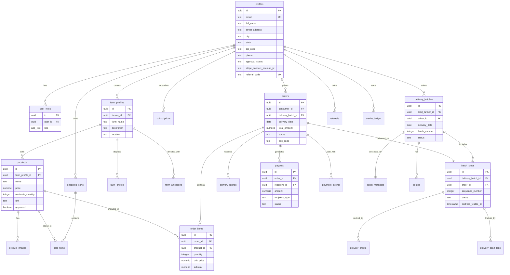
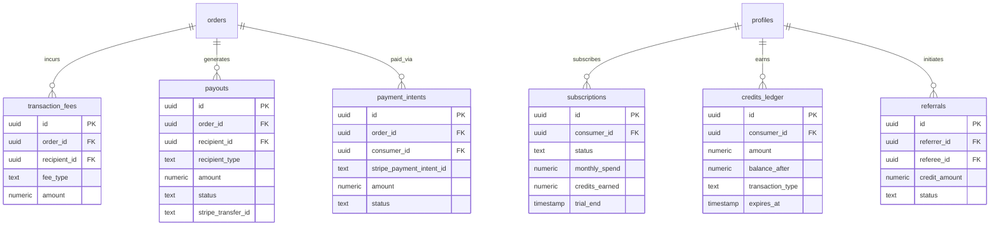
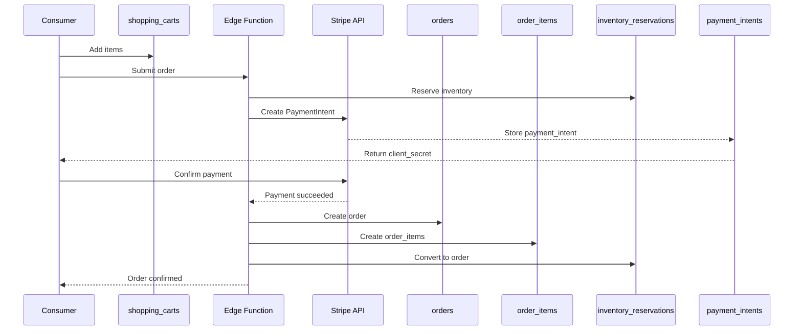
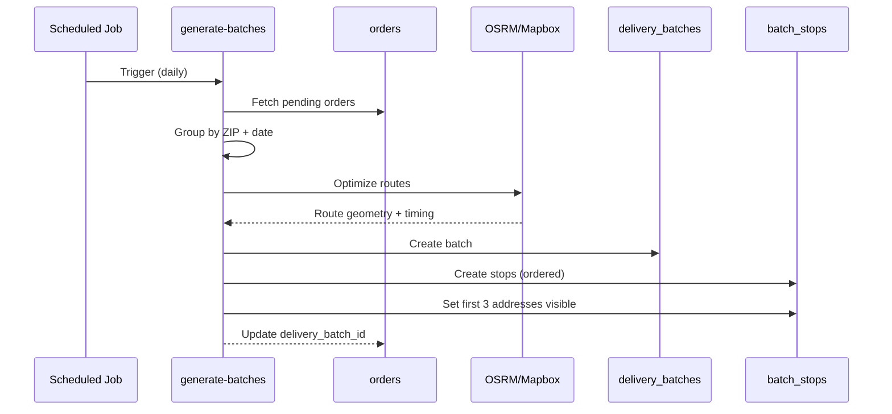
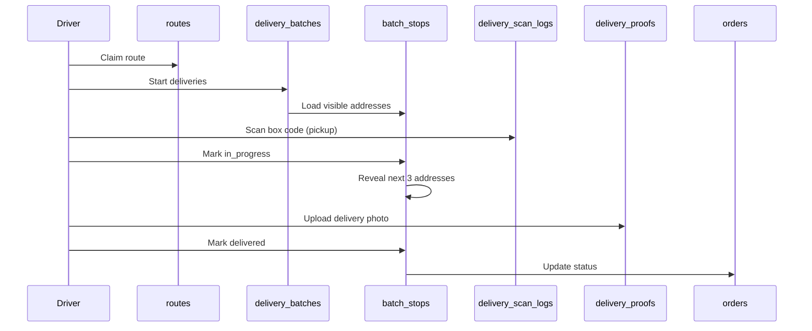
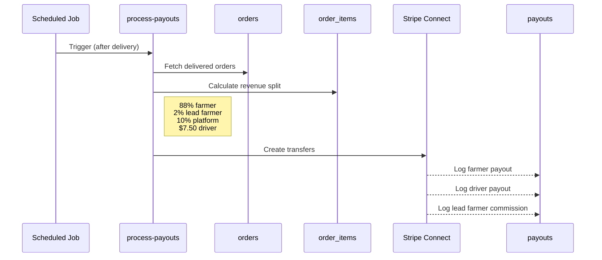
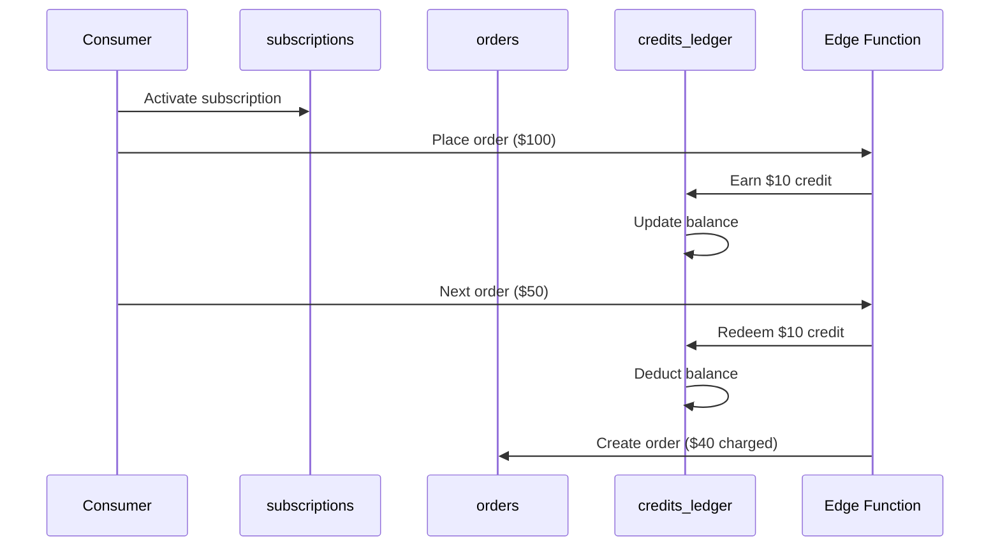

# Database Schema Documentation

> **Documentation Version**: November 2025  
> **Project Status**: Production-ready, active development  
> **If anything seems outdated**: Check Git history or ask maintainers

This document provides a comprehensive overview of the Blue Harvests database schema, including table structures, relationships, security policies, and data flow patterns.

## Table of Contents

- [Overview](#overview)
- [Entity Relationship Diagram](#entity-relationship-diagram)
- [Core Tables](#core-tables)
- [Security Model](#security-model)
- [Data Flow Patterns](#data-flow-patterns)
- [Database Functions](#database-functions)
- [Storage Buckets](#storage-buckets)

## Overview

The Blue Harvests database is built on PostgreSQL (via Supabase) and implements a comprehensive farm-to-table marketplace with:

- **Multi-role authentication** (consumers, farmers, drivers, admins, lead farmers)
- **Row-Level Security (RLS)** for data isolation and privacy
- **Progressive address disclosure** for consumer privacy
- **Financial tracking** for revenue splits and payouts
- **Delivery optimization** with batch routing
- **Subscription management** with credits system
- **Referral program** with rewards tracking

### Technology Stack

- **Database:** PostgreSQL 15+
- **Authentication:** Supabase Auth
- **Storage:** Supabase Storage (product images, documents)
- **Real-time:** Postgres subscriptions via Supabase Realtime

## Entity Relationship Diagram

### Core Domain Model



### Financial & Subscription Model



## Core Tables

### User Management

#### `profiles`
**Purpose:** Extended user information beyond Supabase Auth

**Key Fields:**
- `id` (PK, FK to `auth.users`) - User identifier
- `email` - Email address (unique)
- `full_name` - Display name
- `street_address`, `city`, `state`, `zip_code` - Delivery address
- `phone` - Contact number
- `approval_status` - Account approval state (`pending`, `approved`, `rejected`)
- `stripe_connect_account_id` - Stripe Connect account for payouts
- `referral_code` - Unique referral code (format: `BH{8chars}`)
- `applied_role` - Initial role application (`farmer`, `driver`)

**Security:**
- Consumers can read/update their own profile
- Drivers can only see consumer addresses via `get_consumer_address()` function (progressive disclosure)
- Admins can view/update all profiles

#### `user_roles`
**Purpose:** Multi-role assignment system

**Key Fields:**
- `id` (PK)
- `user_id` (FK to `auth.users`) - User identifier
- `role` - Enum: `consumer`, `farmer`, `lead_farmer`, `driver`, `admin`

**Security:**
- Users can view their own roles
- Users can self-assign `consumer` role only
- Admins manage all role assignments

**Constraints:**
- Unique per `(user_id, role)` - prevents duplicate role assignments

### Products & Inventory

#### `farm_profiles`
**Purpose:** Farmer farm information and branding

**Key Fields:**
- `id` (PK)
- `farmer_id` (FK to `profiles`) - Farm owner
- `farm_name` - Farm display name
- `description` - Farm story and details
- `location` - Farm location text
- `bio` - Farmer biography

**Security:**
- Public read access (anyone can view farms)
- Farmers can create/update their own farm profile
- Admins can manage all farm profiles

#### `products`
**Purpose:** Product catalog with inventory tracking

**Key Fields:**
- `id` (PK)
- `farm_profile_id` (FK to `farm_profiles`) - Product owner
- `name` - Product name
- `description` - Product description
- `price` - Price in USD (numeric)
- `available_quantity` - Current stock
- `unit` - Unit of measure (`lb`, `oz`, `bunch`, `dozen`, etc.)
- `image_url` - Primary product image
- `approved` - Admin approval flag
- `harvest_date` - When product was harvested

**Security:**
- Public read access (all products visible to everyone)
- Farmers can create/update/delete their own products
- Admin approval workflow for quality control

**Business Rules:**
- Inventory reservations during checkout via `inventory_reservations` table
- Automatic inventory deduction on order completion

#### `product_images`
**Purpose:** Additional product photos (beyond primary image)

**Key Fields:**
- `id` (PK)
- `product_id` (FK to `products`)
- `image_url` - Image storage URL
- `display_order` - Sort order

### Shopping & Orders

#### `shopping_carts`
**Purpose:** Active shopping carts for consumers

**Key Fields:**
- `id` (PK)
- `consumer_id` (FK to `profiles`) - Cart owner
- `created_at`, `updated_at` - Timestamps

**Security:**
- Users can only access their own cart
- One active cart per user

#### `cart_items`
**Purpose:** Line items in shopping carts

**Key Fields:**
- `id` (PK)
- `cart_id` (FK to `shopping_carts`)
- `product_id` (FK to `products`)
- `quantity` - Number of units
- `unit_price` - Price at time of adding (snapshot)

**Security:**
- Users can only manage items in their own cart

#### `saved_carts`
**Purpose:** Named cart templates for repeat orders

**Key Fields:**
- `id` (PK)
- `consumer_id` (FK to `profiles`)
- `name` - Cart template name
- `items` - JSONB array of `{product_id, quantity}`

**Security:**
- Users can only manage their own saved carts

#### `orders`
**Purpose:** Placed and completed orders

**Key Fields:**
- `id` (PK)
- `consumer_id` (FK to `profiles`) - Order placer
- `delivery_batch_id` (FK to `delivery_batches`) - Assigned batch
- `delivery_date` - Scheduled delivery date
- `total_amount` - Order total including all fees
- `tip_amount` - Optional driver tip
- `status` - Enum: `pending`, `confirmed`, `in_transit`, `out_for_delivery`, `delivered`, `cancelled`
- `box_code` - QR code identifier (format: `B{batch}-{stop}`)

**Security:**
- Consumers can view their own orders
- Consumers can create orders (via checkout)
- Admins can view all orders
- No direct updates allowed (state changes via edge functions)

**Lifecycle:**
1. `pending` - Order placed, payment processing
2. `confirmed` - Payment successful, batching pending
3. `in_transit` - Assigned to batch, driver claimed route
4. `out_for_delivery` - Driver started deliveries
5. `delivered` - Consumer received order
6. `cancelled` - Order cancelled (before delivery)

#### `order_items`
**Purpose:** Line items in orders (snapshot of cart at checkout)

**Key Fields:**
- `id` (PK)
- `order_id` (FK to `orders`)
- `product_id` (FK to `products`)
- `quantity` - Units ordered
- `unit_price` - Price at time of order (historical)
- `subtotal` - `quantity * unit_price`

**Security:**
- Consumers can view items in their own orders
- Farmers can view order items for their products
- Admins can view all order items

### Delivery System

#### `delivery_batches`
**Purpose:** Grouped orders for efficient driver routes

**Key Fields:**
- `id` (PK)
- `lead_farmer_id` (FK to `profiles`) - Collection point manager
- `driver_id` (FK to `profiles`) - Assigned driver
- `delivery_date` - Target delivery date
- `batch_number` - Sequential batch identifier
- `zip_codes` - Array of covered ZIP codes
- `estimated_duration_minutes` - Route time estimate
- `status` - `pending`, `assigned`, `in_progress`, `completed`

**Security:**
- Drivers can view assigned batches
- Lead farmers can view batches at their collection point
- Admins can view all batches

**Business Rules:**
- Target batch size: 37 orders (configurable per market)
- Min batch size: 30 orders
- Max batch size: 45 orders
- Max route duration: 7.5 hours

#### `batch_stops`
**Purpose:** Individual delivery stops within a batch

**Key Fields:**
- `id` (PK)
- `delivery_batch_id` (FK to `delivery_batches`)
- `order_id` (FK to `orders`) - One-to-one relationship
- `sequence_number` - Stop order in route
- `address` - Full address string
- `street_address`, `city`, `state`, `zip_code` - Parsed address components
- `latitude`, `longitude` - Geocoded coordinates
- `address_visible_at` - Timestamp when address revealed to driver (progressive disclosure)
- `estimated_arrival` - Calculated ETA
- `actual_arrival` - Driver check-in time
- `status` - `pending`, `in_progress`, `delivered`, `failed`
- `geojson` - Route geometry for mapping

**Security:**
- **Progressive Disclosure:** Drivers can only see addresses for:
  - Current stop
  - Next 3 stops in sequence
  - Previous delivered stops
- Admins can view all stops
- Consumers CANNOT view batch stops (privacy protection)

**Progressive Disclosure Trigger:**
When a stop status changes to `in_progress` or `delivered`, the next 3 stops automatically get `address_visible_at` set to `now()`.

#### `batch_metadata`
**Purpose:** Optimization metadata and AI routing data

**Key Fields:**
- `id` (PK)
- `delivery_batch_id` (FK to `delivery_batches`)
- `collection_point_id` (FK to `profiles`) - Lead farmer location
- `order_count` - Orders in batch
- `is_subsidized` - Whether batch received AI routing subsidy
- `ai_optimization_data` - JSONB with route optimization details
- `estimated_route_hours` - AI-calculated route time
- `original_zip_codes` - Pre-merge ZIP codes
- `merged_zips` - ZIP codes merged for efficiency

**Security:**
- Drivers can view metadata for assigned batches
- Lead farmers can view metadata for their collection points
- Admins can view all metadata

#### `delivery_proofs`
**Purpose:** Photo/signature proof of delivery

**Key Fields:**
- `id` (PK)
- `batch_stop_id` (FK to `batch_stops`)
- `driver_id` (FK to `profiles`)
- `photo_url` - Delivery photo (Supabase Storage)
- `signature_url` - Signature image
- `recipient_name` - Who received delivery
- `notes` - Delivery notes
- `delivered_at` - Timestamp

**Security:**
- Drivers can create proofs for their deliveries
- Drivers and admins can view proofs
- Stored in `documents` bucket (private)

#### `delivery_ratings`
**Purpose:** Consumer ratings of driver service

**Key Fields:**
- `id` (PK)
- `order_id` (FK to `orders`)
- `driver_id` (FK to `profiles`)
- `rating` - Integer 1-5
- `feedback` - Optional text feedback

**Security:**
- Consumers can rate their own deliveries (one per order)
- Drivers can view their own ratings
- Admins can view all ratings

**Calculated Metric:**
Function `get_driver_rating(driver_id)` returns average rating rounded to 1 decimal.

### Financial System

#### `payment_intents`
**Purpose:** Stripe PaymentIntent tracking

**Key Fields:**
- `id` (PK)
- `order_id` (FK to `orders`)
- `consumer_id` (FK to `profiles`)
- `stripe_payment_intent_id` - Stripe identifier
- `amount` - Payment amount
- `currency` - Default: `usd`
- `status` - Stripe status (`requires_payment_method`, `succeeded`, etc.)
- `client_secret` - For frontend Stripe.js
- `metadata` - JSONB for additional context

**Security:**
- Consumers can view their own payment intents
- Admins can view all payment intents
- Managed by edge functions only (no direct writes)

#### `transaction_fees`
**Purpose:** Fee breakdown tracking (platform fee, lead farmer commission)

**Key Fields:**
- `id` (PK)
- `order_id` (FK to `orders`)
- `fee_type` - `platform_fee`, `lead_farmer_commission`
- `amount` - Fee amount
- `recipient_id` (FK to `profiles`) - Who receives the fee (for commissions)
- `description` - Fee explanation

**Revenue Split:**
- **88%** → Farmer (product sales)
- **2%** → Lead Farmer (collection point commission)
- **10%** → Platform (operating costs)
- **$7.50** → Driver (flat delivery fee, separate from order total)

**Security:**
- Admins can view all fees
- Farmers can view fees for their products
- Read-only (created by checkout service)

#### `payouts`
**Purpose:** Payment disbursements to farmers and drivers

**Key Fields:**
- `id` (PK)
- `order_id` (FK to `orders`)
- `recipient_id` (FK to `profiles`)
- `recipient_type` - `farmer`, `lead_farmer`, `driver`
- `amount` - Payout amount
- `status` - `pending`, `processing`, `completed`, `failed`
- `stripe_transfer_id` - Stripe transfer reference
- `stripe_connect_account_id` - Recipient's Stripe Connect account
- `completed_at` - When payout succeeded

**Security:**
- Recipients can view their own payouts
- Admins can view all payouts
- Processed by `process-payouts` edge function

**Payout Schedule:**
- Automated payout processing runs after delivery completion
- Requires recipient to have Stripe Connect onboarding complete
- Transfers directly to recipient bank accounts

#### `credits_ledger`
**Purpose:** Consumer credits tracking (rewards program)

**Key Fields:**
- `id` (PK)
- `consumer_id` (FK to `profiles`)
- `transaction_type` - `earned`, `redeemed`, `referral_bonus`, `expired`
- `amount` - Credit delta (positive for earn, negative for redeem)
- `balance_after` - Running balance
- `order_id` (FK to `orders`) - Related order (if applicable)
- `expires_at` - Credit expiration date
- `description` - Transaction description

**Credit Rules:**
- **Earning:** Subscription members earn $10 credit per $100 spent
- **Redemption:** Credits applied at checkout (up to 100% of order)
- **Referral Bonus:** $25 credit for referrer when referee places first order
- **Expiration:** Credits expire 12 months after earning

**Security:**
- Consumers can view their own credits
- Admins can view all credits
- Read-only (managed by edge functions)

#### `subscriptions`
**Purpose:** Monthly subscription membership tracking

**Key Fields:**
- `id` (PK)
- `consumer_id` (FK to `profiles`)
- `stripe_subscription_id` - Stripe subscription ID
- `stripe_customer_id` - Stripe customer ID
- `status` - `active`, `trialing`, `past_due`, `cancelled`, `inactive`
- `current_period_start`, `current_period_end` - Billing period
- `monthly_spend` - Spend in current month
- `credits_earned` - Credits earned in current month
- `trial_end` - Trial period end date
- `cancel_at_period_end` - Cancellation flag

**Subscription Benefits:**
- 10% cashback as credits on all purchases
- No delivery fees for subscription members
- Early access to limited products (future)

**Security:**
- Consumers can view/create their own subscription
- Admins can view/update all subscriptions

### Referral & Growth

#### `referrals`
**Purpose:** Referral program tracking

**Key Fields:**
- `id` (PK)
- `referrer_id` (FK to `profiles`) - User who referred
- `referee_id` (FK to `profiles`) - User who was referred
- `status` - `pending`, `credited`, `expired`
- `credit_amount` - Bonus amount (default $25)
- `referee_first_order_id` (FK to `orders`) - Triggers credit
- `credited_at` - When credit was awarded

**Referral Flow:**
1. Referrer shares their `referral_code` (from `profiles`)
2. Referee signs up using code
3. Status = `pending`
4. Referee places first order → Status = `credited`
5. Both users receive $25 credit

**Security:**
- Users can view referrals they initiated or received
- Admins can view all referrals
- Credits managed by edge functions

### Admin & Configuration

#### `market_configs`
**Purpose:** Market-specific settings and rules

**Key Fields:**
- `id` (PK)
- `zip_code` - Market ZIP code
- `delivery_days` - Array of weekday integers (0=Sunday, 6=Saturday)
- `cutoff_time` - Order cutoff time (e.g., `18:00:00` for 6 PM)
- `delivery_fee` - Delivery fee (default $7.50)
- `minimum_order` - Minimum order amount (default $25)
- `collection_point_id` (FK to `profiles`) - Lead farmer's collection point
- `target_batch_size` - Optimal batch size (default 37)
- `min_batch_size` - Minimum viable batch (default 30)
- `max_batch_size` - Maximum batch (default 45)
- `max_route_hours` - Maximum route duration (default 7.5)
- `active` - Whether market is accepting orders

**Security:**
- Admins can manage market configs
- Authenticated users can view active markets
- Used by checkout and batch generation

#### `farm_affiliations`
**Purpose:** Lead farmer relationships with other farmers

**Key Fields:**
- `id` (PK)
- `lead_farmer_id` (FK to `profiles`)
- `farm_profile_id` (FK to `farm_profiles`) - Affiliated farm
- `commission_rate` - Commission % (default 2.0%)
- `active` - Whether affiliation is active

**Business Logic:**
- Lead farmers provide collection points for nearby farmers
- Lead farmers earn commission on affiliated farmers' sales
- Commission calculated as % of order total for affiliated products

**Security:**
- Lead farmers can view their affiliations
- Admins can manage all affiliations

#### `admin_audit_log`
**Purpose:** Audit trail for admin actions

**Key Fields:**
- `id` (PK)
- `admin_id` (FK to `profiles`) - Admin who performed action
- `action_type` - Action identifier
- `target_user_id` (FK to `profiles`) - Affected user
- `target_resource_type`, `target_resource_id` - Affected resource
- `old_value`, `new_value` - JSONB change tracking
- `ip_address`, `user_agent` - Request metadata

**Logged Actions:**
- User role assignments/changes
- Approval status changes
- Market config updates
- Manual payout processing
- Credit adjustments

**Security:**
- Admins can insert their own actions
- Admins can view all audit logs
- Immutable (no updates/deletes)

### Support & Moderation

#### `disputes`
**Purpose:** Order dispute and resolution tracking

**Key Fields:**
- `id` (PK)
- `order_id` (FK to `orders`)
- `consumer_id` (FK to `profiles`)
- `dispute_type` - `missing_items`, `quality_issue`, `late_delivery`, `other`
- `description` - Consumer's dispute details
- `status` - `open`, `under_review`, `resolved`, `closed`
- `refund_amount` - Partial/full refund amount
- `resolution` - Admin resolution notes
- `resolved_by` (FK to `profiles`) - Admin who resolved
- `resolved_at` - Resolution timestamp

**Security:**
- Consumers can create disputes for their orders
- Consumers can view their own disputes
- Admins can view/update all disputes

## Security Model

### Row-Level Security (RLS)

All tables have RLS enabled. Access is controlled via policies that check:

1. **User Identity:** `auth.uid()` - Current authenticated user
2. **User Roles:** `has_role(user_id, role)` - Security definer function
3. **Data Ownership:** Foreign key relationships (e.g., `consumer_id = auth.uid()`)

### Role Hierarchy

```
admin (highest privilege)
  ↓
lead_farmer (collection point manager)
  ↓
farmer (product seller)
  ↓
driver (delivery provider)
  ↓
consumer (shopper)
```

### Common RLS Patterns

#### Self-Service Pattern
Users can manage their own data:
```sql
-- Users can view own orders
auth.uid() = consumer_id
```

#### Role-Based Pattern
Specific roles have access:
```sql
-- Admins can view all records
has_role(auth.uid(), 'admin')
```

#### Relationship Pattern
Access through foreign key relationships:
```sql
-- Farmers can view order items for their products
EXISTS (
  SELECT 1 FROM products p
  JOIN farm_profiles fp ON fp.id = p.farm_profile_id
  WHERE p.id = order_items.product_id 
    AND fp.farmer_id = auth.uid()
)
```

#### Progressive Disclosure Pattern
Time-based access (unique to Blue Harvests):
```sql
-- Drivers see addresses only when visible
EXISTS (
  SELECT 1 FROM delivery_batches db
  JOIN batch_stops bs ON bs.delivery_batch_id = db.id
  WHERE db.driver_id = auth.uid()
    AND bs.address_visible_at IS NOT NULL
)
```

### Security Definer Functions

These functions bypass RLS and run with elevated privileges:

#### `has_role(_user_id, _role)`
Checks if a user has a specific role. Used in RLS policies to avoid recursive queries.

#### `get_consumer_address(_consumer_id, _delivery_batch_id)`
Returns consumer address with access control:
- Consumer can see own address
- Admin can see every address
- Driver can see address ONLY if:
  - Address is visible (`address_visible_at` set)
  - Order is in driver's assigned batch
  - Current stop or next 3 stops in sequence

#### `generate_referral_code()`
Generates unique `BH{8chars}` referral code. Called by `handle_new_user()` trigger.

#### `generate_box_code(batch_id, stop_sequence)`
Generates QR code for order boxes: `B{batch_number}-{stop_sequence}`

#### `get_driver_rating(driver_id)`
Calculates average driver rating rounded to 1 decimal place.

### Storage Security

#### `product-images` bucket (public)
- Public read access
- Farmers can upload images for their products

#### `documents` bucket (private)
- Tax documents (W-9, 1099)
- Insurance documents (COI, driver's license)
- Delivery proof photos
- Access controlled via RLS on referencing tables

## Data Flow Patterns

### Checkout Flow



### Batch Generation Flow



### Delivery Flow



### Payout Flow



### Credits & Subscription Flow



## Database Functions

### Triggers

#### `handle_new_user()`
**Fires on:** `auth.users` INSERT  
**Purpose:** Auto-create profile with referral code
```sql
INSERT INTO profiles (id, email, full_name, referral_code)
VALUES (NEW.id, NEW.email, ..., generate_referral_code())
```

#### `auto_approve_consumer()`
**Fires on:** `user_roles` INSERT  
**Purpose:** Auto-approve users who sign up as consumers
```sql
IF NEW.role = 'consumer' THEN
  UPDATE profiles SET approval_status = 'approved' WHERE id = NEW.user_id
END IF
```

#### `update_address_visibility()`
**Fires on:** `batch_stops` UPDATE  
**Purpose:** Progressive disclosure - reveal next 3 addresses when stop progresses
```sql
IF NEW.status IN ('delivered', 'in_progress') THEN
  UPDATE batch_stops SET address_visible_at = now()
  WHERE sequence_number BETWEEN NEW.sequence_number + 1 AND NEW.sequence_number + 3
END IF
```

#### `handle_updated_at()`
**Fires on:** Various table UPDATEs  
**Purpose:** Auto-update `updated_at` timestamp

### Maintenance Functions

#### `cleanup_expired_invitations()`
Removes expired admin invitations (unused tokens).

#### `cleanup_old_rate_limits()`
Removes rate limit entries older than 1 hour.

## Storage Buckets

### `product-images` (Public)
**Purpose:** Product photos  
**Access:** Public read, farmers can upload  
**File types:** JPG, PNG, WebP  
**Max size:** 5 MB

### `documents` (Private)
**Purpose:** Sensitive documents  
**Contents:**
- Tax documents (W-9, 1099)
- Insurance documents
- Driver licenses
- Certificate of Insurance (COI)
- Delivery proof photos

**Access:** RLS-controlled based on document ownership

## Indexes

Key indexes for performance:

```sql
-- User lookup
CREATE INDEX idx_profiles_email ON profiles(email);
CREATE INDEX idx_profiles_referral_code ON profiles(referral_code);

-- Order queries
CREATE INDEX idx_orders_consumer_id ON orders(consumer_id);
CREATE INDEX idx_orders_delivery_date ON orders(delivery_date);
CREATE INDEX idx_orders_status ON orders(status);

-- Delivery optimization
CREATE INDEX idx_batch_stops_delivery_batch_id ON batch_stops(delivery_batch_id);
CREATE INDEX idx_batch_stops_sequence ON batch_stops(delivery_batch_id, sequence_number);

-- Financial queries
CREATE INDEX idx_payouts_recipient_id ON payouts(recipient_id);
CREATE INDEX idx_payouts_status ON payouts(status);
CREATE INDEX idx_credits_ledger_consumer_id ON credits_ledger(consumer_id);

-- Product search
CREATE INDEX idx_products_farm_profile_id ON products(farm_profile_id);
CREATE INDEX idx_products_approved ON products(approved);
```

## Constraints & Validations

### Check Constraints

```sql
-- Positive quantities
CHECK (quantity > 0)

-- Valid ratings
CHECK (rating BETWEEN 1 AND 5)

-- Valid percentages
CHECK (commission_rate BETWEEN 0 AND 100)

-- Valid amounts
CHECK (amount >= 0)
```

### Unique Constraints

```sql
-- One cart per user
UNIQUE (consumer_id) ON shopping_carts

-- One role assignment per user per role
UNIQUE (user_id, role) ON user_roles

-- One order per batch stop
UNIQUE (order_id) ON batch_stops

-- Unique referral codes
UNIQUE (referral_code) ON profiles
```

## Views

### `driver_batch_stops`
**Purpose:** Driver-friendly view with only visible addresses  
**Filters:** Only shows stops where `address_visible_at IS NOT NULL`  
**Used by:** Driver mobile interface

### `driver_batch_stops_secure`
**Purpose:** Secure driver view respecting progressive disclosure  
**Security:** Uses `get_consumer_address()` function for address fields

## Performance Considerations

### Query Optimization
- Use indexed columns in WHERE clauses
- Leverage JSONB indexes for metadata queries
- Use materialized views for complex analytics
- Partition large tables by date if needed

### Connection Pooling
Supabase automatically manages connection pooling. Default settings:
- Pool size: 15 connections
- Statement timeout: 8 seconds
- Idle timeout: 10 minutes

### Real-time Subscriptions
Enabled for tables that need live updates:
- `orders` - Order status tracking
- `batch_stops` - Delivery progress
- `delivery_batches` - Route assignments

Enable via:
```sql
ALTER PUBLICATION supabase_realtime ADD TABLE orders;
```

## Backup & Recovery

### Automated Backups
Supabase provides:
- **Daily backups** (retained 7 days on Free, 30+ days on Pro)
- **Point-in-time recovery** (Pro plan)
- **Manual backups** via dashboard

### Data Export
Export tables via:
1. Supabase Dashboard → Database → Tables → Export
2. `pg_dump` for full database backup
3. API queries with pagination for selective exports

## Migration Strategy

### Schema Changes
1. Create migration file in `supabase/migrations/`
2. Test locally with `supabase db reset`
3. Deploy via Lovable Cloud (automatic)
4. Verify with `supabase db diff`

### Data Migrations
1. Use `INSERT ... ON CONFLICT` for upserts
2. Batch large updates (e.g., 1000 rows at a time)
3. Use transactions for consistency
4. Test with sample data first

### Breaking Changes
When removing columns:
1. Add new column
2. Migrate data gradually
3. Update application code
4. Mark old column deprecated
5. Remove after validation period

## Troubleshooting

### Common RLS Issues

**Symptom:** "new row violates row-level security policy"  
**Cause:** Insert policy not allowing write  
**Fix:** Check that `WITH CHECK` includes `auth.uid() = owner_column`

**Symptom:** "infinite recursion detected in policy"  
**Cause:** RLS policy references same table  
**Fix:** Use security definer function instead

**Symptom:** Data not visible after insert  
**Cause:** SELECT policy too restrictive  
**Fix:** Ensure SELECT policy matches INSERT policy

### Performance Issues

**Symptom:** Slow order queries  
**Solution:** Add index on `consumer_id` + `delivery_date`

**Symptom:** Batch generation timeout  
**Solution:** Increase function timeout, optimize route algorithm

**Symptom:** High connection count  
**Solution:** Use connection pooling, close idle connections

## See Also

- [ARCHITECTURE.md](./ARCHITECTURE.md) - How these tables fit into overall system design
- [SECURITY.md](./SECURITY.md) - RLS policies and access control implementation
- [API.md](./API.md) - Edge function endpoints that interact with these tables
- [QUICKSTART.md](./QUICKSTART.md) - Developer quick start guide

## Additional Resources

- [Supabase RLS Documentation](https://supabase.com/docs/guides/auth/row-level-security)
- [PostgreSQL Security](https://www.postgresql.org/docs/current/ddl-rowsecurity.html)
- [Database Design Best Practices](https://www.postgresql.org/docs/current/ddl-basics.html)
- [Blue Harvests API Documentation](./API.md)
- [Security Overview](./SECURITY.md)
